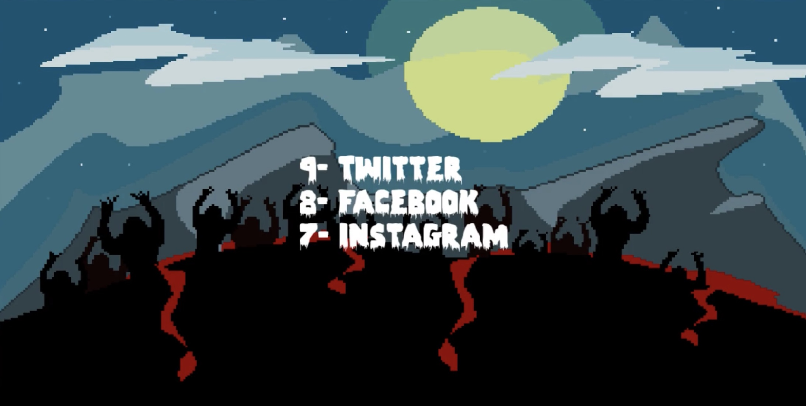

# social-zombie-arena

A game in which social media site has to survive waves of Zombies in SFML C++

Shortcut keys
--------
- "Esc" for exit from the game
- "Enter" for start / pause the game
- "Left mouse button" for a shot from a gun
- "Right mouse button" for reload a weapon
- "W" / "S" / "A" / "D"  for movement
- Num1 / Num2 / Num3 / Num4 / Num5 / Num6 for level up the player at the start of each level

Screenshots
-----------

  

  

  

